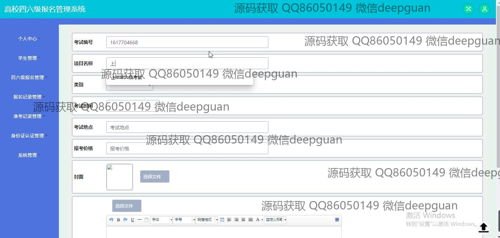

<h1 align="center">的四六级英语报名系统</h1>

## 简介
四六级英语报名管理系统：角色分为管理员、用户；功能包括四六级报名管理、学生管理、报名记录管理、身份认证管理，支持在线客服和信息查询。    --计算机毕业设计源码；毕设源码；java毕业设计源码

## 联系方式

<h3 align="center">获取完整代码与数据库文件 + 微信：deepguan QQ: 86050149 QQ群: 783742310</h3>

<h3 align="center">可帮忙远程部署 包运行成功！提供远程部署、修改代码、设计文档指导、代码讲解等服务！</h3>

## 功能介绍（完整见运行截图）
管理员：基本功能包括登录、注册和修改密码。可以进行学生管理、报名记录管理、准考记录管理、身份认证管理和系统配置。能够审核学生报名信息，管理考试信息并支持信息导入导出。此外，还可通过客服聊天功能进行用户支持和查询反馈。

学生：用户需注册并进行身份认证，完成个人信息的填写和更新和报名管理。学生可查看和管理考试报名记录，包括修改考试信息如时间、地点和支付状态。用户界面提供文件上传功能供上传相关证件照片和文件。而且，学生还可访问在线客服进行咨询。

## 运行截图

本代码来源于网络,仅供学习参考使用!

